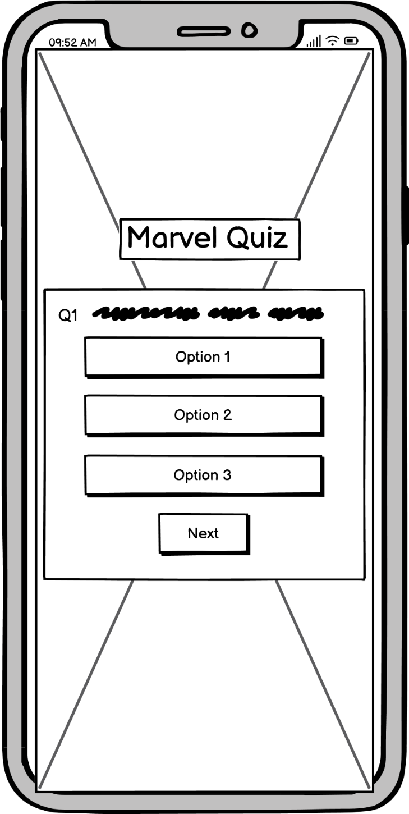
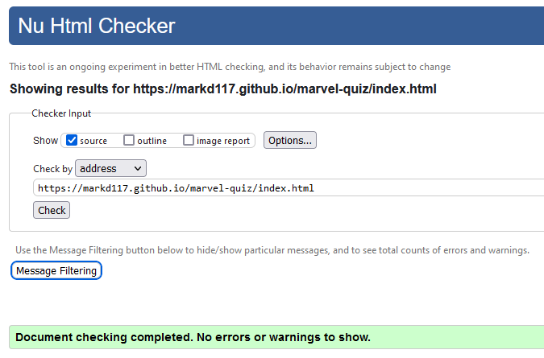
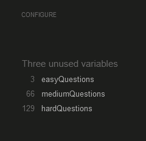

# Marvel Quiz
Marvel Quiz is a fun interactive trivia quiz that tests the players knowledge about all things marvel. The quiz consists of 3 difficulties with different questions. I recommend starting with the easy questions and working your way up from there. These quiz questions are based off the MCU (Marvel Cinematic Universe) and some of them might stump even the most devoted marvel fans!

Think you know everything there is to know about the MCU? Let's see how close you were really paying attention to the 32 (and counting) movies that have been released so far! Have a go at the quiz and lets see how you do!

The live project can be accessed [here](https://markd117.github.io/marvel-quiz/)

## UI/UX

### Design Overview
For the design of the quiz, I wanted something that was interesting and fun to look at whilst also retaining a common theme. The site has a main background image consisting of well-known Marvel characters in front of a stylistic blue background. This image frames the main content well, and I find, is interesting for the player to look at. The secondary background is for the quiz content. This background consists of a patterned red image that contrasts well with the blue of the main background.

the same red background is used for all quiz content, staying with the same theme throughout. All of the Main text content uses a font called 'Poppins', which is pleasant to look at, easy to read and is relatively close to the font used in the official Marvel Logo. All of the buttons for the quiz are an off-white colour with black text. This allows the buttons to be easily distinguished from the backgroud as well as easily read by the player.

Again, this button style theme is kept consistant throughout the quiz with small variations in size. Outside of the quiz content is the main quiz heading and the main quiz home button. The heading is centered in the viewport and styled to look similar to the Marvel logo. The home button is a home icon that is in the same red and white stye as the rest of the quiz elements. Both of these elements will always be shown and can be accessed as they are fixed and will not change when navigating the quiz.

### Colour Scheme
Marvel traditionally tend to use very bright and bold colours. As the background is already very vibrant, colourful and active, the quiz uses quite a simple colour palette as not too over-stimulate the player with a plethora of different colours. A deep red and off white colours were used interchangeably for backgrounds and outlines. If text is on a red background, it is set to off-white. If text is on a white background, it is set to black. 

Generally, white text is for headings and black text is for buttons. This increases the readability for the user. The deep red colour is applied to main button text using hover effects. This black, red and white colour Scheme is used throughout the quiz and contrasts well with the blue of the main quiz background. There are two separate colour schemes used for the correct and incorrect styles set for the answer buttons after the user selects and option. The HEX codes and colour palettes can be seen below!

#### Main Colour Palette

- `#000000` used for button text.
- `#FAFAFA` used for heading text, borders & backgrounds.
- `#FF0013` used for borders & backgrounds.

#### Correct Colour Palette

- `#155724` used for button text.
- `#D4EDDA` used for button background.
- `#C3E6CB` used for button border.

#### Incorrect Colour Palette

- `#721C24` used for button text.
- `#F8D7DA` used for button background.
- `#F5C6CB` used for button border.

### Fonts & Icons
- The 'Poppins' font was used for all text in the quiz. 

This font was sourced from [google fonts](https://fonts.google.com/).

- The home icon used on the main page
- Tick icon used for answer buttons
- Cross icon used for answer buttons

Icons sourced from [Font Awesome](https://fontawesome.com/).

## User Stories

- As a new site user, I'd like to understand the site's goal so that I can determine whether I would like to use it or not.
- As a new site user, I'd like to understand how to play the game.
- As a new site user, I'd like the navigation to be simple and easy to understand.
- As a new site user, I'd like the site to be interesting to look at and fun to play.
- Ad a new site user, I'd like the game to test my knowledge and give me feedback on my progress.

## Wirefames

During the planning stages, I  created wireframes for all pages of the site. [Balsamiq](https://balsamiq.com/wireframes) to design the digital wireframes. All wireframes can be seen below.

### Quiz Home Page Wireframes

Click to see the Quiz Home Page Wireframes

| Type | Image |
| --- | --- |
| Desktop |  |
| Mobile |  |

### Quiz Rules Menu Wireframes

Click to see the Quiz Rules Menu Wireframes

| Type | Image |
| --- | --- |
| Desktop |  |
| Mobile |  |

### Difficulty Selection Menu Wireframes

Click to see Difficulty Selection Menu Wireframes

| Type | Image |
| --- | --- |
| Desktop |  |
| Mobile |  |

### Quiz Ready Up Menu Wireframes

Click to see the Quiz Ready Up Menu Wireframes

| Type | Image |
| --- | --- |
| Desktop |  |
| Mobile |  |

### Quiz Questions Page Wireframes

Click to see the Quiz Questions Page Wireframes

| Type | Image |
| --- | --- |
| Desktop |  |
| Mobile |  |

### Quiz Results Menu Wireframes

Click to see the Quiz Results Menu Wireframes

| Type | Image |
| --- | --- |
| Desktop |  |
| Mobile |  |

## Features

### Quiz Home Page

- The quiz home page consists of two main buttons. These are the Quiz button and the Rules button. Upon clicking the Quiz button, the quiz home menu will disappear and the select difficulty menu will be shown to the player. Similarly, when the Rules button is clicked, the home menu will disappear, and the quiz rules will be shown to the player.

    

### Quiz Rules menu

- The quiz rules menu explains to the user how to play the game and how the quiz functions.

    

### Main Quiz Home Button

- The main quiz home button is displayed to the player at all times. It can be seen under the quiz content denoted by a 'Home' icon. This button has a hover effect that reverses the colours and will turn the cursor to a pointer if it is placed over it. Hover effect can be seen below.

- The main funtion of this home button is to refresh the page and return the user to the home page when clicked by the player.

      

### Quiz Difficulty Selection

- This menu is used to set the specific question pool depending on the users selected difficulty. The user is presented with three buttons of varying difficulty. When a button is clicked, a function is run that will set the questions shown to an predetermined array of easy, medium or hard questions.

- The player can replay the quiz and choose a new difficulty each time which will provide them with different questions for all three options.

    

### Quiz Ready Up menu

- After selecting a difficulty, the player will be presented with a ready up menu before starting the quiz. This allows the player to gather their thoughts and essentially, get ready before starting the quiz.

- On the menu there is a Start Quiz button. When clicked, the quiz starts and the user can begin to play the game.

    

### Quiz Questions Page

- Upon starting the quiz, the ready up menu will disappear and Quiz Questions Page will be shown. the player will be presented with a question at the top of top of the main quiz container. Underneath the question are four selectable buttons.

    

#### Quiz Questions & Answer Buttons

- The question displayed is randomly selected from an array based on the difficulty chosen by the player. The buttons are also randomly organised from top to bottom which provides the player with a highly replayable experience. Each time the user replays the quiz, the questions and buttons will be in a different order.

#### Selecting an Answer

- When the player selects an answer, a function will run that checks if the selected answer is correct. If the answer the player selected is correct, the button will turn a green colour and the next question button will appear. 

- If the answer the player selects is found to be incorrect, the selected button will turn red and the correct answer will be highlighted green.

- Depending on whether the answer button is correct or incorrect, a tick or cross icon will appear under the text of the button.

- After the player has selected an answer, all buttons become disabled and can no longer be clicked. The `cursor: pointer;` property is also removed further showing the user that the buttons are not clickable. 

- Any buttons that are not highlighted as correct/incorrect will be greyed out further distinguishing the other relevant answers.

- The next button is hidden until the player selects an answer. Clicking the button will display the next question and reset the state of the answer buttons allowing the player to select another answer.

- Below we can see what the quiz questions page looks like after the player selects an incorrect answer.

    

#### Quiz Question Number

- In front of the question is the question number. This allows the player to keep track of what question they are on and how many they have left to answer. The question counter is a separate entity to the questions as the questions appear in a random order.

- Each time a new question is displayed, the question counter is increased by 1. If the quiz is replayed or a new difficulty is selected. The counter is reset to its default value of 1.

- Below you can see that the number of the question has increased as we have moved on to the next question in the set.

    

### Quiz Results Menu

- After completing the quiz, the quiz questions screen will disappear and the Quiz Results Menu will be shown to the user. There is a few interesting features in this menu. First of which, is a score tracker. When the user selects a correct answer, their score will be increased by 1. After they have answered the final question, they will be presented with their score value, depending on how many questions they answered correctly.

- As well as tracking the player score, personalised messages will be displayed, depending on how many questions the player answered correctly. Below we can see the message displayed after answering all five questions correctly.

- There are two buttons on the results menu. These are the Replay Quiz and Main Menu buttons. If the player clicks the replay quiz button, it will allow them to re-take the same difficulty quiz again without having to return to the main home menu. If you don't get a perfect score the first time, this button will let you take the quiz again.

- Clicking the main menu button will reset the quiz, hide the results screen and bring the user back to the main home menu.

    

## Future Features

### Storing The User Score

- A future feature I would be keen to add is a way for the player to store their score for each individual quiz. I would like to have a feature where they can enter their name and save their score to another menu accessed on the main home page. This could possibly be done through the use of session cookies.

### Timer Based Questions

- Another feature that I would like to add in the future is to have a timer displayed on the quiz questions area. The timer will count down from a set time which will be different for each difficulty. If the timer reaches 0 before the player selects an answer, the question will auto-complete and the correct answer will be highlighted; however, the players score will not increase as they have not answered the question.

### Impossible Difficulty

- An interesting feature I would like to add is another difficulty level called 'Impossible'. This difficulty would contain questions that would puzzle even the most die-hard Marvel fans. Combined with a short timer, this quiz difficulty would truly be a challenge!

### Increase Quiz Questions

- In future, I also want to increase the number of questions shown to the player. Increasing the number of questions would allow the user to have a more detailed experience when playing the quiz.

## Technologies Used

- HTML used to create main site content.
- CSS used designing and styling the layout of the site.
- JavaScript used to implement features and functionality to the game.
- Chrome DevTools - Used to debug and test responsiveness of the site
- Git used for version control
- GitHub used to store game source code.
- GitHub Pages used to deploy the main game
- Gitpod used as a cloud-based IDE for developing the game.

## Testing

### Code Validation

[HTML W3C Validator](https://validator.w3.org) was used to validate the html code. No errors were found.

- index.html Validation
   
    

[CSS Jigsaw Validator](https://jigsaw.w3.org/css-validator) was used to validate CSS files. No errors were found.

- style.css Validation
    
    

[JSHint](https://jshint.com/) was used to validate JavaScript files. No significant errors were found; however, there are some warnings that are addressed in further detail in the [Known Bugs](##known-bugs) section.

- script.js Validation

    

    

    

- questions.js Validation

    

### Lighthouse Testing

[Lighthouse](https://developer.chrome.com/docs/lighthouse/overview/) was used to test the site performance, accessibility, best practices and SEO (Search Engine Optimisation).

The site scored an almost perfect score with only the performance section getting a score of 90/100.

### Colour Accessibility

[A11Y](https://color.a11y.com/Contrast/) was used to test the accessibility of background/text colour contrasts. As we can see in the image below, there are no contrast issues present.

[Adobe Color](https://color.adobe.com/create/color-contrast-analyzer) was also used to test the initial color contrasts. As we can see below, the off-white text fails the contrast ratio on smaller text. That said, there is no text that size in the Marvel Quiz project.

### Browser Compatibility

The site has been tested on the following browsers:

- Google Chrome
- Mozilla FireFox
- Microsoft Edge
- iOS (Mobile)
- Android

### Testing and Results

#### **Quiz Home Page**

| Item | Test | Expected Outcome | Result | 
|--|--|--|--|
| Site Elements | Page Load | All elements and styles load and are shown | pass
| Quiz Button | Click button | Hides home menu and shows difficulty selector | pass
| Rules Button | Click button | Hides home menu and shows quiz rules | pass
| Main Home Button | Click home button | Refreshes page and brings user back to main home page | pass
| Main Home Button | Hover on button | Shows button hover effect | pass
| Main Home Button | Hover on button | Cursor changes to pointer | pass
| Quiz Home Page Buttons | Hover on button | Shows button hover effect | pass
| Quiz Home Page Buttons | Hover on button | Cursor changes to pointer | pass

#### **Quiz Rules Menu**

| Item | Test | Expected Outcome | Result | 
|--|--|--|--|
| Rules | Click rules button | All rules are displayed and can be seen clearly | pass
| Rules | Click rules button | Rules container size changes for mobile | pass

#### **Quiz Difficulty Selection**

| Item | Test | Expected Outcome | Result | 
|--|--|--|--|
| Difficulty Buttons | Hover on button | Button hover styles are shown | pass
| Difficulty Buttons | Hover on button | Cursor changes to pointer | pass
| Difficulty Buttons | Click button | Sets the question pool to the chosen difficulty | pass
| Difficulty Buttons | Click button | Hides the difficulty selection menu and shows the ready up menu | pass

#### **Quiz Ready Up Menu**

| Item | Test | Expected Outcome | Result | 
|--|--|--|--|
| Start Quiz Button | Hover on button | Button hover styles are shown | pass
| Start Quiz Button | Hover on button | Cursor changes to pointer | pass
| Start Quiz Button | Click button | Hides ready up menu and shows quiz questions page | pass

#### **Quiz Questions Page**

| Item | Test | Expected Outcome | Result | 
|--|--|--|--|
| Quiz Question | Start Quiz | Correct difficulty question is displayed | pass
| Answer Buttons | Start Quiz | Correct answer buttons are shown | pass
| Answer Buttons | Start Quiz | Answer button order is randomised | pass
| Answer Buttons | Hover on button | Button hover styles are shown | pass
| Answer Buttons | Hover on button | Cursor changes to pointer | pass
| Answer Buttons | Click button | Quiz correctly calculates correct answer | pass
| Answer Buttons | Click button | Correct style is applied to button when clicked | pass
| Answer Buttons | Click button | Correct button will be highlighted when player answers incorrectly | pass
| Answer Buttons | Click button | Buttons are disabled after answering | pass
| Answer Buttons | Click button | Cursor changes back to default after answering | pass
| Next Button | Click answer button | Button shown after answering | pass
| Next Button | Hover on button | Button hover styles are shown | pass
| Next Button | Hover on button | Cursor changes to pointer | pass
| Next Button | Click button | Shows next question | pass
| Next Button | Click button | Resets state of answer buttons | pass
| Next Button | Click button | Button becomes hidden after click | pass
| Question Counter | Click next button | Counter increases with questions | pass
| Next Button | Click button | After final question, hides quiz questions and shows quiz results menu | pass

#### **Quiz Results Menu**

| Item | Test | Expected Outcome | Result | 
|--|--|--|--|
| Player Score | Complete Quiz | Quiz calculates and displays correct score | pass
| Quiz Result Feedback | Complete Quiz | Correct message displayed depending on player score | pass
| Results Menu Buttons | Hover on button | Button hover styles are shown | pass
| Results Menu Buttons | Hover on button | Cursor changes to pointer | pass
| Replay Quiz Button | Click button | Restarts the quiz at the chosen difficulty | pass
| Main Menu Button | Click Button | Resets the quiz and brings the user back to the main home page | pass

## Bug Fixes

### Button Stacking

The first issue that I ran into was when I was trying to position the button elements within the main quiz container. Initially, to do this I used postition absolute alongside the top, left and transform properties to position all buttons in the center. This caused all button elements to ingore each other and stack on top of each other rendering most of them useless.

The fix for this was to give the menu container a display of grid and wrap the buttons in their own div. I then used `display: flex;` on the button container to center the buttons within the grid. This would prevent the buttons from ignoring each other and stacking.

### Main Heading Stretching

Another bug I ran into was with the main heading. The background of the main heading was stretching with different screen sizes. In some cases this would cause extremely large gaps in to each side of the heading text making it appear very out of place.

I initially set the heading as `position: absolute;` to prevent this stretching bug but it caused the main quiz container to clip under the heading. The fix for this bug was similar to the button stacking issue.

I gave the header `display: grid` and wrapped the main heading in its own div. I then used flexbox to center the heading within the grid. This allowed me to change the background width, without affecting the position of the heading.

#### Bug

#### Old Code

#### Fixed Code

### Background Overflow

After adding the rules section I was testing to see what it looked like on different screen sizes. I found that above 1030px the quiz background no longer can contain the quiz rules content. This caused it to overflow outside of the background.

The fix for this bug was to add a media query at 1030px to restrict the width of the rules page to a maximum of 800px. This would prevent the content from overflowing and it would sit neatly in its container.

#### Code For Fix

#### Background no Longer overflowing

### Next Button Not Hiding

When clicking the next button after answering a question, the button should disappear. The button was hidden for the first question but stayed after answering the first question. The fix for this was quite simple. In the nextQuestion function, I added a line of code that would re-hide the next question button when clicked.

Below you can see the next question button has the hidden class added when clicked.

#### Initial Code

#### Fixed Code

## Known Bugs

### JSHint Warnings

#### **Unexpected Use Of "|"**

The first warning is to do with the use of a bitwise logical operator. It is unclear why JSHint displayes this an error, but its speculated that it is because "|" is a bitwise logical operator that isn't actually manipulating bits. More information on this can be found on Stack Overflow [here](https://stackoverflow.com/questions/11605068/why-does-jshint-argue-against-bitwise-operators-how-should-i-express-this-code).

#### **Undefined Variables**

 
The second warning that appears in JSHint are three undefined variables. This warning appears due to the fact that there is a separate JavaScript file that contains the questions. These variables are not definded in script.js; however, they are defined in questions.js.

#### **Unused Variables**

The final warning that appears pertains to three unused variables in the questions.js file. Similar to the undefined variables in the previous warning, this is caused by having separate JavaScript files. These variables are used in the script.js file and are defined in the questions.js file. 

## Deployment

### GitHub Pages Deployment

The site was deployed to GitHub Pages. The steps to deploy are as follows:
- In the [GitHub repository](https://github.com/MarkD117/marvel-quiz), navigate to the Settings tab 
- From the source section drop-down menu, select the **Main** Branch, then click "Save".
- The page will be automatically refreshed with a detailed ribbon display to indicate the successful deployment.

The live link can be found [here](https://markd117.github.io/marvel-quiz/)

### Fork Repository on GitHub

A copy of the GitHub Repository can be made by forking the GitHub account. Changes can be made on this copy without affecting the original repository.

- Log in to GitHub and locate [GitHub repository](https://github.com/MarkD117/marvel-quiz).
- Locate the Fork button which can be found in the top corner, right-hand side of the page, inline with the repository name.
- Click this button to create a copy of the original repository in your own GitHub Account.

### Clone Repository on GitHub

- Click on the code button which is underneath the main tab and repository name to the right.
- In the 'Clone with HTTPS' section, click on the clipboard icon to copy the URL.
- Open Git Bash in your IDE of choice.
- Change the current working directory to where you want the cloned directory to be made.
- Type git clone, and then paste the URL copied from GitHub.
- Press enter and the clone of your repository will be created.

## Credits

| Source | Item | Notes |
| --- | --- | --- |

| [Web Dev Simplified](https://www.youtube.com/watch?v=riDzcEQbX6k&t) | JavaScript | Randomising quiz question order |
| [Slaying The Dragon](https://www.youtube.com/watch?v=EiNiSFIPIQE&t) | CSS | Understanding CSS Grid |
| [Google Fonts](https://fonts.google.com/) | Font | Source for font used on the site |
| [Font Awesome](https://fontawesome.com/) | Icons | Source for all icons used on the site |
| [Code Institute](https://learn.codeinstitute.net/courses/course-v1:CodeInstitute+LMR101+2021_T1/courseware/73e9c0413ead4a21b389e33c77706102/4fe6474cab114387ad0e72bf7ec1c201/) | Data Structures | Iterating nested data structures |
| [Wallpaper Safari](https://wallpapersafari.com/red-background-images/) | Quiz Background Image | Background for quiz content |
| [Wallpapers.com](https://wallpapers.com/4k-marvel) | Main Site Background Image | Background for quiz content |
| [Coding Nepal Web](https://www.codingnepalweb.com/quiz-app-with-timer-javascript/) | JavaScript | Tick & Cross icons for answer buttons |
| [StackOverflow](https://stackoverflow.com/questions/22754315/for-loop-for-htmlcollection-elements) | For in loop | Iterating HTML Collection |
| [StackOverflow](https://stackoverflow.com/questions/7070054/javascript-shuffle-html-list-element-order) | Answer Buttons | Randomisation of answer buttons |
| [StackOverflow](https://stackoverflow.com/questions/13831601/disabling-and-enabling-a-html-input-button) | Answer Buttons | Disabling answer buttons |
| [StackOverflow](https://stackoverflow.com/questions/2754546/can-i-disable-a-css-hover-effect-via-javascript) | Answer Buttons | Removing button hover effects |
| [StackOverflow](https://stackoverflow.com/questions/31977100/git-push-is-pushing-to-the-wrong-repo) | GitPod | Pushing to wrong repository fix |
| [W3Docs](https://www.w3docs.com/snippets/css/how-to-center-the-content-in-grid.html) | CSS Grid | Centring content in a grid |
| [W3Schools](https://www.w3docs.com/snippets/css/how-to-center-the-content-in-grid.html) | Cursor pointer | How to use cursor pointer property |
| [Sitepoint](https://www.sitepoint.com/simple-javascript-quiz/) | Quiz | Question structure inspiration |
| [Readme.so](https://readme.so/) | Markdown | Tool used for visualising creating and visualising readme content |
| [Markdown Builder](https://traveltimn.github.io/markdown-builder/) | Markdown | Assistance in creating markdown content |