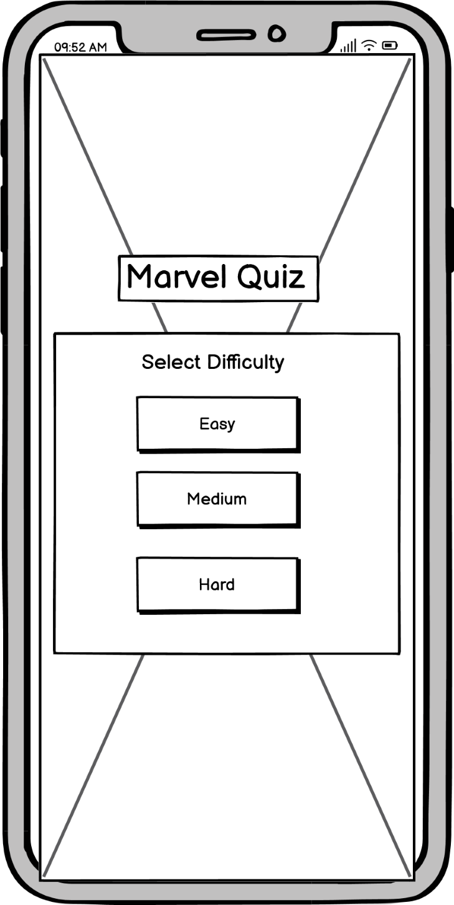

# Marvel Quiz
Marvel Quiz is a fun interactive trivia quiz that tests the players knowledge about all things marvel. The quiz consists of 3 difficulties with different questions. I recommend starting with the easy questions and working your way up from there. These quiz questions are based off the MCU (Marvel Cinematic Universe) and some of them might stump even the most devoted marvel fans!

Think you know everything there is to know about the MCU? Let's see how close you were really paying attention to the 32 (and counting) movies that have been released so far! Have a go at the quiz and lets see how you do!

The live project can be accessed [here](https://markd117.github.io/marvel-quiz/)

## UI/UX

### Design Overview
For the design of the quiz, I wanted something that was interesting and fun to look at whilst also retaining a common theme. The site has a main background image consisting of well-known Marvel characters in front of a stylistic blue background. This image frames the main content well, and I find, is interesting for the player to look at. The secondary background is for the quiz content. This background consists of a patterned red image that contrasts well with the blue of the main background.

the same red background is used for all quiz content, staying with the same theme throughout. All of the Main text content uses a font called 'Poppins', which is pleasant to look at, easy to read and is relatively close to the font used in the official Marvel Logo. All of the buttons for the quiz are an off-white colour with black text. This allows the buttons to be easily distinguished from the backgroud as well as easily read by the player.

Again, this button style theme is kept consistant throughout the quiz with small variations in size. Outside of the quiz content is the main quiz heading and the main quiz home button. The heading is centered in the viewport and styled to look similar to the Marvel logo. The home button is a home icon that is in the same red and white stye as the rest of the quiz elements. Both of these elements will always be shown and can be accessed as they are fixed and will not change when navigating the quiz.

### Colour Scheme
Marvel traditionally tend to use very bright and bold colours. As the background is already very vibrant, colourful and active, the quiz uses quite a simple colour palette as not too over-stimulate the player with a plethora of different colours. A deep red and off white colours were used interchangeably for backgrounds and outlines. If text is on a red background, it is set to off-white. If text is on a white background, it is set to black. 

Generally, white text is for headings and black text is for buttons. This increases the readability for the user. The deep red colour is applied to main button text using hover effects. This black, red and white colour Scheme is used throughout the quiz and contrasts well with the blue of the main quiz background. There are two separate colour schemes used for the correct and incorrect styles set for the answer buttons after the user selects and option. The HEX codes and colour palettes can be seen below!

#### Main Colour Palette

- `#000000` used for button text.
- `#FAFAFA` used for heading text, borders & backgrounds.
- `#FF0013` used for borders & backgrounds.

#### Correct Colour Palette

- `#155724` used for button text.
- `#D4EDDA` used for button background.
- `#C3E6CB` used for button border.

#### Incorrect Colour Palette

- `#721C24` used for button text.
- `#F8D7DA` used for button background.
- `#F5C6CB` used for button border.

### Fonts & Icons
- The 'Poppins' font was used for all text in the quiz. This font was sourced from [google fonts](https://fonts.google.com/).

- The home icon on the main page was sourced from [Font Awesome](https://fontawesome.com/).

## User Stories

- As a new site user, I'd like to understand the site's goal so that I can determine whether I would like to use it or not.
- As a new site user, I'd like to understand how to play the game.
- As a new site user, I'd like the navigation to be simple and easy to understand.
- As a new site user, I'd like the site to be interesting to look at and fun to play.
- Ad a new site user, I'd like the game to test my knowledge and give me feedback on my progress.

## Wirefames

During the planning stages, I  created wireframes for all pages of the site. [Balsamiq](https://balsamiq.com/wireframes) to design the digital wireframes. All wireframes can be seen below.

### Quiz Home Page Wireframes

Click to see the Quiz Home Page Wireframes

| Type | Image |
| --- | --- |
| Desktop |  |
| Mobile |  |

### Quiz Rules Menu Wireframes

Click to see the Quiz Rules Menu Wireframes

| Type | Image |
| --- | --- |
| Desktop |  |
| Mobile |  |

### Difficulty Selection Menu Wireframes

Click to see Difficulty Selection Menu Wireframes

| Type | Image |
| --- | --- |
| Desktop |  |
| Mobile |  |

### Quiz Ready Up Menu Wireframes

Click to see the Quiz Ready Up Menu Wireframes

| Type | Image |
| --- | --- |
| Desktop |  |
| Mobile |  |

### Quiz Questions Page Wireframes

Click to see the Quiz Questions Page Wireframes

| Type | Image |
| --- | --- |
| Desktop |  |
| Mobile |  |

### Quiz Results Menu Wireframes

Click to see the Quiz Results Menu Wireframes

| Type | Image |
| --- | --- |
| Desktop |  |
| Mobile |  |

## Features

### Quiz Home Page

- The quiz home page consists of two main buttons. These are the Quiz button and the Rules button. Upon clicking the Quiz button, the quiz home menu will disappear and the select difficulty menu will be shown to the player. Similarly, when the Rules button is clicked, the home menu will disappear, and the quiz rules will be shown to the player.

### Quiz Rules menu

- The quiz rules menu explains to the user how to play the game and how the quiz functions.

### Main Quiz Home Button

- The main quiz home button is displayed to the player at all times. It can be seen under the quiz content denoted by a 'Home' icon. This button has a hover effect that reverses the colours and will turn the cursor to a pointer if it is placed over it.

- The main funtion of this home button is to refresh the page and return the user to the home page when clicked by the player.

### Quiz Difficulty Selection

- This menu is used to set the specific question pool depending on the users selected difficulty. The user is presented with three buttons of varying difficulty. When a button is clicked, a function is run that will set the questions shown to an predetermined array of easy, medium or hard questions.

- The player can replay the quiz and choose a new difficulty each time which will provide them with different questions for all three options.

